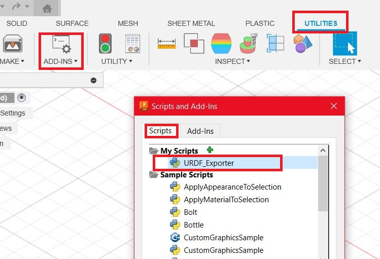
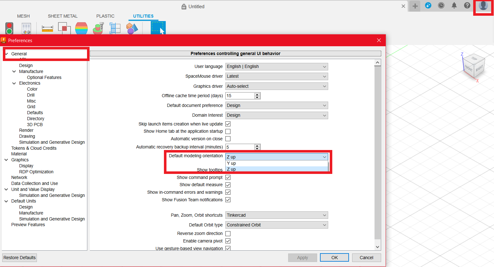

# fusion2urdf
This repository is forked from the work by [SpaceMaster85](https://github.com/SpaceMaster85) at [SpaceMaster85/fusion2urdf](https://github.com/SpaceMaster85/fusion2urdf). 

[SpaceMaster85](https://github.com/SpaceMaster85) added some major updates to the API and added a GUI Dialog Popup for ROS version selection and improved upon the original work [syuntoku14/fusion2urdf](https://github.com/syuntoku14/fusion2urdf) by [syuntoku14](https://github.com/syuntoku14/fusion2urdf)

I improved the robot description package structures that are generated by the script for ROS and ROS 2. Also, added support for ROS 2 with Gazebo Sim (previously Ignition Gazebo) launch file.

Hope you enjoy the new features!

<details>
  <summary> 🎯Major Updates & Revisions🎯 </summary>

&emsp;-> <b>2024/03/21: Version 1.3</b><br>
&emsp;&emsp;&emsp;↳ Added support for ROS 2 Gazebo Sim (previously Ignition Gazebo) Launch File<br>
&emsp;&emsp;&emsp;↳ Updated the template packages<br>
&emsp;&emsp;&emsp;↳ All launch files are well commented for better understanding<br>

&emsp;-> <b>2021/10/13: Version 1.2</b><br>
&emsp;&emsp;&emsp;↳ Made the color and material detection more robust<br>
&emsp;&emsp;&emsp;↳ Added ROS 2 launchfile generator<br>
&emsp;&emsp;&emsp;↳ Dialog Popup to choose between ROS 1 and ROS 2<br>

&emsp;-> <b>2021/03/09: version 1.1</b><br>
&emsp;&emsp;&emsp;↳ Fix FusionAPI Change<br>

&emsp;-> <b>2021/01/23: Version 1.0</b><br>
&emsp;&emsp;&emsp;↳ This version can handle now nested components<br>
&emsp;&emsp;&emsp;↳ The bodies and components which should be exported can be choosen via the light bulbs in Fusion 360<br>
&emsp;&emsp;&emsp;↳ Joints with disabled light bulb will be ignored and not exported to the urdf file<br>
&emsp;&emsp;&emsp;↳ Hopefully final bugfix of the joint coordinates calculation<br>
&emsp;&emsp;&emsp;↳ Reading out the color of the component and set it in the material file<br>
&emsp;&emsp;&emsp;↳ All changes are done in a temporary file, so no backup of your design file is necessary (but it is still a good idea)
   This means that also linked components can be used<br>
&emsp;&emsp;&emsp;↳ Added two example Fusion 360 files, which can be found in the _Example_ folder<br>

&emsp;-> <b>2021/01/09: Fix xyz calculation. </b><br>
&emsp;&emsp;&emsp;↳ If you see that your components move arround the map center in rviz try this update<br> 
&emsp;&emsp;&emsp;↳ More Infos see: [difference-of-geometryororiginone-and-geometryororiginonetwo](https://forums.autodesk.com/t5/fusion-360-api-and-scripts/difference-of-geometryororiginone-and-geometryororiginonetwo/m-p/9837767)<br>

&emsp;-> <b>2020/11/10: README fix</b><br>
&emsp;&emsp;&emsp;↳ MacOS Installation command fixed in README<br>
&emsp;&emsp;&emsp;↳ Date format unified in README to yyyy/dd/mm<br>
&emsp;&emsp;&emsp;↳ Shifted Installation Upwards for better User Experience and easier to find<br>
  
&emsp;-> <b>2020/01/04: Multiple updates:</b><br>
&emsp;&emsp;&emsp;↳ no longer a need to run a bash script to convert stls<br>
&emsp;&emsp;&emsp;↳ some cleanup around joint and transmission generation<br>
&emsp;&emsp;&emsp;↳ defines a sample material tag instead of defining a material in each link<br>
&emsp;&emsp;&emsp;↳ fusion2urdf now generates a self-contained ROS {robot_name}_description package<br>
&emsp;&emsp;&emsp;↳ now launched by roslaunch {robot_name}_description display.launch<br>
&emsp;&emsp;&emsp;↳ changed fusion2urdf output from urdf to xacro for more flexibility<br>
&emsp;&emsp;&emsp;↳ separate out material, transmissions, gazebo elements to separate files<br>

&emsp;-> <b>2018/20/10: Fixed functions to generate launch files</b><br>

&emsp;-> <b>2018/25/09: Supports joint types "Rigid", "Slider" & Supports the joints' limit(for "Revolute" and "Slider"). </b><br>

&emsp;-> <b>2018/19/09: Fixed the bugs about the center of the mass and the inertia.</b><br>

</details>

## What is this fusion2urdf?

The fusion2urdf script allows you to export URDF files from 3D CAD models into a robot description package. The generated description package contains URDF files, meshes (.stl), RViz config and launch files and Gazebo launch files. 

It supports for both **ROS 1 (Gazebo Classic)** and **ROS 2 (Gazebo Classic** and **Gazebo Sim)**

## Installation

### (Option 1) Using zip from release section 
Go to the [release](https://github.com/nilutpolkashyap/fusion2urdf/releases) section and download the latest release [**URDF_Exporter.zip**](https://github.com/nilutpolkashyap/fusion2urdf/releases/tag/v1.3)  of the fusion2urdf script

Place the unzipped folder inside the following location based on your OS:

  - #### Windows
    ```bash
    %appdata%\Autodesk\Autodesk Fusion 360\API\Scripts
    ```
    e.g. -
    ```bash
    C:\Users\<USER_NAME>\AppData\Roaming\Autodesk\Autodesk Fusion 360\API\Scripts
    ```


  - #### Mac
    ```bash
    $HOME/Library/Application Support/Autodesk/Autodesk Fusion 360/API/Scripts
    ```

### (Option 2) Using command line 

Download the zip of the **fusion2urdf** project.

Run the following command from inside the project folder in your shell based on your OS:

  - #### Windows (In PowerShell)

    ```powershell
    cd <path to fusion2urdf>
    Copy-Item ".\URDF_Exporter\" -Destination "${env:APPDATA}\Autodesk\Autodesk Fusion 360\API\Scripts\" -Recurse
    ```

  - #### macOS (In bash or zsh)

    ```bash
    cd <path to fusion2urdf>
    cp -r ./URDF_Exporter "$HOME/Library/Application Support/Autodesk/Autodesk Fusion 360/API/Scripts/"
    ```

### Testing the installation

To test if the fusion2urdf script was correctly installed, go to **Utilities** -> **ADD-INS** -> **Scripts and Add-Ins**

A new window will open, you should be able to see the **URDF_Exporter** listed under **My Scripts** inside the **Scripts** section

<div align="center">

</div>

## Steps to use the fusion2urdf script

**NOTE:** By default, Fusion 360 has the Y-axis Up when first installed. Follow the [steps here](https://github.com/nilutpolkashyap/fusion2urdf/blob/master/TROUBLESHOOTING.md#fusion2urdf-troubleshooting-guide) to to select the Z-axis as Up instead of Y up.


<div align="center">

</div>

### Before using this script

**NOTE:** Make sure that this script currently supports only "Rigid", "Slider" and "Revolute".

- Before using this script, make sure that your model has all the "links" as components. You have to define the links by creating corresponding components.

- In addition to that, you should be careful when define your joints. The parent links should be set as Component2 when you define the joint, not as Component1. For example, if you define the "base_link" as Component1 when you define the joints, an error saying "KeyError: base_link__1" will show up.


- Nested components are exported as a single stl file. Therefore only joints on the root level will be taken into calculation!

- Joints in nested components and on lower levels will be ignored. Only components and bodies with activated light bulb will be exported, components and bodies with deactivated light bulb will be ignored and not exported!

- Joints which has a deactivated child component will be ignored. Deactivating the base_link will cause problems! Joints with deactivated light bulbs will not be exported!

- Colors which are defined on the root level components will be read out and taken over into the material definition of the urdf file.


**NOTE:** Sometimes this script exports abnormal urdf without any error messages. In that case, the joints should have problems. Redefine the joints and run again.


## How to use the generated robot description package in ROS / ROS 2

### ROS 1
- Place the generated **description** package directory inside the **src** in your ROS workspace (e.g. ~/catkin_ws).
- Build and source the workspace by running the following inside your workspace
    ```bash
    cd ~/catkin_ws/
    catkin_make
    source devel/setup.bash
    ```
- Run the following to visualize the Robot URDF in RViz
  ```bash
  roslaunch <YOUR_ROBOT_NAME>_description display.launch
  ```
- Run the following to simulate the robot in Gazebo Classic simulator
  ```bash
  roslaunch <YOUR_ROBOT_NAME>_description gazebo.launch
  ```

### ROS 2
- Place the generated **description** package directory inside the **src** in your ROS 2 workspace (e.g. ~/ros2_ws).
- Build and source the workspace by running the following inside your workspace
    ```bash
    cd ~/ros2_ws/
    colcon build
    source install/setup.bash
    ```
- Run the following to visualize the Robot URDF in RViz
  ```bash
  ros2 launch <YOUR_ROBOT_NAME>_description display.launch.py
  ```
- Run the following to simulate the robot in Gazebo Classic simulator
  ```bash
  ros2 launch <YOUR_ROBOT_NAME>_description gazebo.launch.py
  ```
- Run the following to simulate the robot in Gazebo Sim simulator (previously Ignition)
  ```bash
  ros2 launch <YOUR_ROBOT_NAME>_description gz-sim.launch.py
  ```
## Additional Resources
These are some great resources I found online to help you get started with Fusion 360 for designing your own custom robot simulations for ROS / ROS 2

- [How to install Fusion2URDF Plugin || Use Autodesk Fusion 360 designs in ROS Simulation as URDF](https://youtu.be/TitHYg-5_j8?si=77jO9Y3g4QXhp5-7)
- [How to Design a Robot in FUSION 360 for ROS Simulation || Beginner Tutorial - Autodesk Fusion 360](https://youtu.be/1zB7rc2DBjk?si=zK6s3-Gmc0ZMijU_)
- [Fusion 360 to URDF | Simple Diff Drive Robot Modelling | ROS | Mapping | Navigation | Part -1](https://youtu.be/cQh0gNfb6ro?si=QHXEHRVwEn4Oo5vx)
- [ArmBot Fusion360 to URDF in ROS2 | Part 1 ](https://youtu.be/_ZFo6wPXjeQ?si=S1ej4J12gJTM7USi)
- [ Creating Robot URDF from Fusion 360 Design for @jamesbruton from XRobots](https://www.youtube.com/live/o7w7yv-Nros?si=6QwC4wgs1n14hD8i)


**NOTE:** This repo only supports Gazebo, if you are using pybullet, see: [yanshil/Fusion2PyBullet](https://github.com/yanshil/Fusion2PyBullet).

## Issues and Discussions

If you encounter any issues, have questions, or need assistance, please don't hesitate to reach out! You can start an issue in the [Issues section](https://github.com/nilutpolkashyap/fusion2urdf/issues) for bug reports, feature requests, or general troubleshooting. 

Alternatively, feel free to initiate a discussion in the [Discussions section](https://github.com/nilutpolkashyap/fusion2urdf/discussions) to engage with the community, share ideas, or seek advice. 

Your feedback and contributions are highly valued.


**Enjoy your Fusion 360 and ROS life!**


